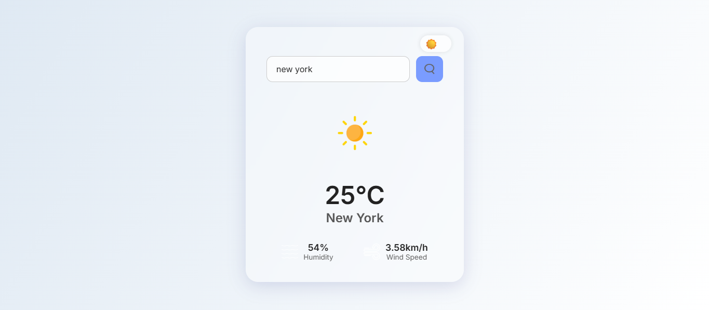

# Weather App

A sleek, modern weather application that lets users search for the current weather by city name. Features a clean glassmorphism style with smooth light/dark mode toggle.

---

## Demo

  


---

## Features

- Search weather by city name using OpenWeatherMap API
- Displays temperature, humidity, wind speed, and weather icon
- Responsive and visually appealing glassmorphism design
- Smooth toggle between Light and Dark modes with animated sun/moon icons
- Theme preference saved in localStorage for persistence

---

## Technologies Used

- HTML5
- CSS3 (with glassmorphism styling)
- JavaScript (fetch API and DOM manipulation)
- OpenWeatherMap API for weather data

---

## Getting Started

### Prerequisites

- Modern web browser (Chrome, Firefox, Edge, Safari)
- Internet connection (to fetch weather data)

### Setup

1. Clone the repository:

```bash
git clone https://github.com/your-username/weather-app.git
cd weather-app
